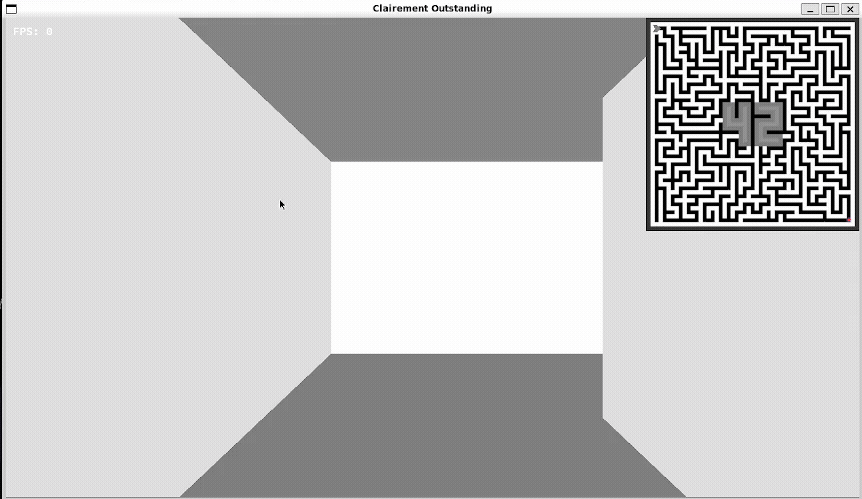

*This project has been created as part of the 42 curriculum by gviola-l, mphippen.*


<a name="header"></a>
[](https://www.python.org/)
[](https://www.x.org/wiki/)
[]()
[]()
[]()

## Table of Contents
- [Description](#description)
- [How To Run](#instructions)
- [Configuration](#config)
- [Reusability](#reusability)
- [Resources](#resources)
- [Contributions](#contributions)

---

<a name="description"></a>
## `🔍` | Description

**A-maze-ing** is a Python project designed to explore and experiment with **maze generation** and **maze-solving** algorithms. It provides a framework to:

* Create mazes of various sizes and complexities
* Visualize mazes
* Determine the optimal path from a given entry point to a specified exit point

This version of the project integrates a simplified version of another 42 project (**Cub3D**) as a **visualizer**, allowing you to:

* Navigate the maze from a **first-person perspective**
* Interact with maze features using **chat commands**



---

<a name=instructions></a>
## `📝` | Instructions

To run the project, follow these steps:

```shell
# Ensure Git and Python 3.10 are installed

# Clone the repository
git clone https://github.com/Gqtien/A-maze-ing.git
cd A-Maze-Ing

# Run the program
make run default_config.txt
```

 ---

<a name=config></a>
## `⚙️` | Configuration

A complete configuration template is available at the root of the project in `default_config.txt`.

### Maze Settings

| Key       | Description                         | Valid Values / Notes                  | Mandatory |
| --------- | ----------------------------------- | ------------------------------------- | --------- |
| `WIDTH`   | Width of the maze                   | Integer > 0 and < 1000                | True      |
| `HEIGHT`  | Height of the maze                  | Integer > 0 and < 1000                | True      |
| `ENTRY`   | Coordinates of the maze entry point | Must be within maze boundaries        | True      |
| `EXIT`    | Coordinates of the maze exit point  | Must be within maze boundaries        | True      |
| `PERFECT` | Whether the maze is perfect         | Perfect = exactly one unique solution | True      |
| `ALGO`    | Maze generation algorithm           | `backtracking`, `prim`                | False     |
| `PATTERN` | Digits used for center pattern      | Exactly 2 valid digits                | False     |

---

### Window Settings

| Key         | Description               | Valid Values / Notes   | Mandatory |
| ----------- | ------------------------- | ---------------------- | --------- |
| `WIN_W`     | Width of the game window  | >0 and < screen width  | False     |
| `WIN_H`     | Height of the game window | >0 and < screen height | False     |
| `WIN_TITLE` | Title of the game window  | Any string             | False     |
| `FOV`       | Field of view (degrees)   | >20 and < 120          | False     |
| `FPS`       | FPS indicator             | True / False           | False     |

---

### Gameplay Settings

| Key              | Description               | Valid Values / Notes                | Mandatory |
| ---------------- | ------------------------- | ----------------------------------- | --------- |
| `MODE`           | Movement key bindings     | Exactly 4 valid keyboard characters | False     |
| `MOUSE`          | Mouse controls            | True / False                        | False     |
| `PLAYBACK_SPEED` | Playback speed multiplier | > 0                                 | False     |
| `SOLUTION`       | Show solution at startup  | True / False                        | False     |

---

### Visual Settings

| Key     | Description | Valid Values / Notes                                         | Mandatory |
| ------- | ----------- | ------------------------------------------------------------ | --------- |
| `COLOR` | Wall color  | `Cyan`, `White`, `Blue`, `Magenta`, `Red`, `Green`, `Yellow` | False     |

---

### Output Settings

| Key           | Description            | Valid Values / Notes | Mandatory |
| ------------- | ---------------------- | -------------------- | --------- |
| `OUTPUT_FILE` | Path to save maze data | Any valid file path  | True      |

---

<a name="reusability"></a>
## `🔄` | Reusability

Although the **visualization part** is a bonus, the **maze generation and solving classes** are fully reusable.

You can compile the package with:
```bash
make compile
```

This will create a wheel file in `dist/` like:
```
mazegen-{version}-py3-none-any.whl
```

You can then install it with:
```bash
pip install dist/mazegen-{version}-py3-none-any.whl
```

### Example usage

```python
# Enter the Python interpreter
$ python3

# Import the package
>>> from mazegen import Maze

# Generate a maze with (width, height, entry_coordinates, exit_coordinates)
>>> maze = Maze(10, 10, (0, 0), (9, 9))

# Print the ASCII representation of the maze
>>> print(maze)

# Print the solution as a list of cell coordinates
>>> print(maze.solution)
```

## Maze parameters

| Key              | Type                       | Mandatory |
| ---------------- | -------------------------- | --------- |
| width            | int                        | True      |
| height           | int                        | True      |
| entry_pos        | tuple[int, int]            | True      |
| exit_pos         | tuple[int, int]            | True      |
| output_file_name | str \| None = None         | False     |
| perfect          | bool = True                | False     |
| seed             | int \| None = None         | False     |
| pattern          | Pattern \| None = None     | False     |
| algo             | Algo = Algo.BACKTRACKING   | False     |

## Exposed methods

| Method                           | Output                     | Description                                |
| -------------------------------- | -------------------------- | ------------------------------------------ |
| `_generate()`                    | `None`                     | Generate the maze                          |
| `_backtracking(rng)`             | `None`                     | Generate maze using backtracking algorithm |
| `_prim(rng)`                     | `None`                     | Generate maze using Prim's algorithm       |
| `pathfind(a, b)`                 | `list[Cell]`               | Compute path between two coordinates       |
| `cardinal_path(path)`            | `str`                      | Convert a path to cardinal directions      |
| `get_neighbors(cell)`            | `list[Cell]`               | Return all neighboring cells               |
| `get_accessible_neighbors(cell)` | `list[Cell]`               | Return accessible neighbors                |
| `get_cell(x, y)`                 | `Cell`                     | Retrieve a specific cell                   |
| `get_maze()`                     | `list[list[Cell]]`         | Return full maze structure                 |
| `to_grid()`                      | `list[list[bool]]`         | Convert maze to boolean grid               |
| `solution_to_grid()`             | `list[tuple[int, int]]`    | Return solution path coordinates           |
| `save_to_file(filename)`         | `None`                     | Save maze to file                          |

---

<a name="resources"></a>
## `📚` | Resources

### Documentation
* [Maze generation algorithms on Wikipedia](https://en.wikipedia.org/wiki/Maze_generation_algorithm)
* [Raycasting guide](https://lodev.org/cgtutor/raycasting.html)

### AI Usage
AI was used during the development of this project for code reviews, identifying potential edge-case failures, creating proofs of concept prior to implementing complex features, and debugging.

---

<a name="contributions"></a>

## `👥` | Contributions

### Contributors

* [Gatien](https://github.com/Gqtien/) `(gviola-l)`
* [Marcel](https://github.com/PurpleProg/) `(mphippen)`

### Team Roles

* Both team members contributed **equally** to all aspects of the project. There were no fixed roles : coding, testing, planning, and debugging were done **collaboratively**.

### Project Planning & Evolution

* **Maze generation algorithm used:** Iterative Backtracking & Prim
* **Reason for choice:** Iterative Backtracking was implemented first as a base because it is one of the **simplest** algorithms to code. Prim’s algorithm was then added to introduce **variation**: while Iterative Backtracking produces a **smooth, straightforward** maze, Prim generates more **branches and random pathways**, creating a more complex and varied layout.

### Successes & Improvements

* Successfully implemented a fully functional maze generator and solver with integrated 3D visualization.
* Optimized performance for smoother rendering.
* Planned improvements: display the solution path directly on the 3D viewer floor.

### Used Tools

* **Programming languages:** Python
* **Libraries:** MLX, NumPy, Pynput 
* **AI assistance:** [See abobe](#resources)
